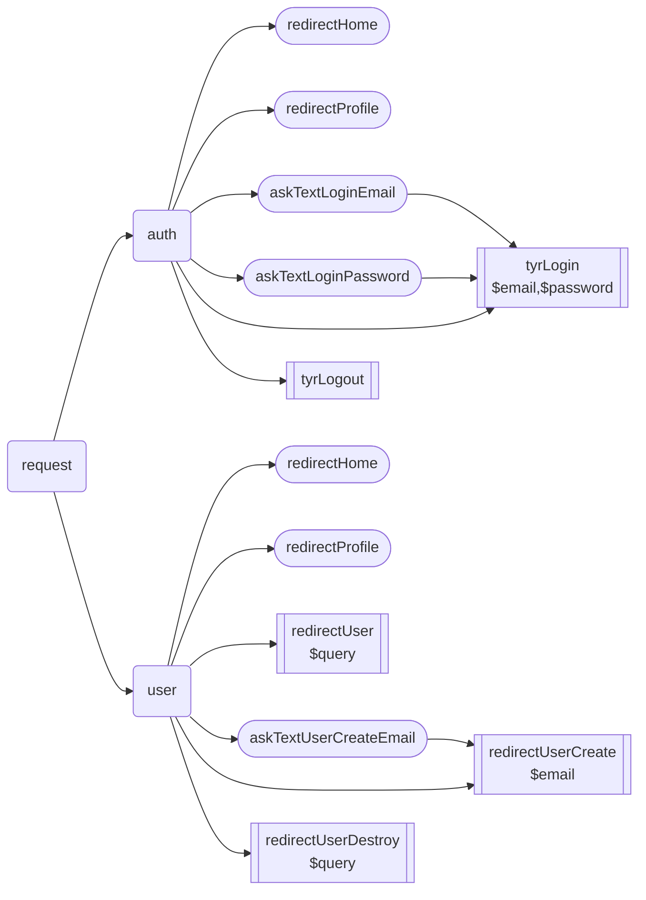

```mermaid
flowchart LR
    request(request) --> auth(auth)
        auth --> Home1([redirectHome])
        auth --> Profile1([redirectProfile])
        auth --> TextLoginEmail([askTextLoginEmail])
        auth --> TextLoginPassword([askTextLoginPassword])
        auth --> Login[[tyrLogin
        $email,$password]]
        TextLoginEmail --> Login
        TextLoginPassword --> Login
        auth --> Logout[[tyrLogout]]
    request --> user(user)
        user --> Home2([redirectHome])
        user --> Profile2([redirectProfile])
        user --> User[[redirectUser
        $query]]
        user --> TextUserCreateEmail([askTextUserCreateEmail])
        user --> UserCreate[[redirectUserCreate
        $email]]
        TextUserCreateEmail --> UserCreate
        user --> UserDestroy[[redirectUserDestroy
        $query]]
```
