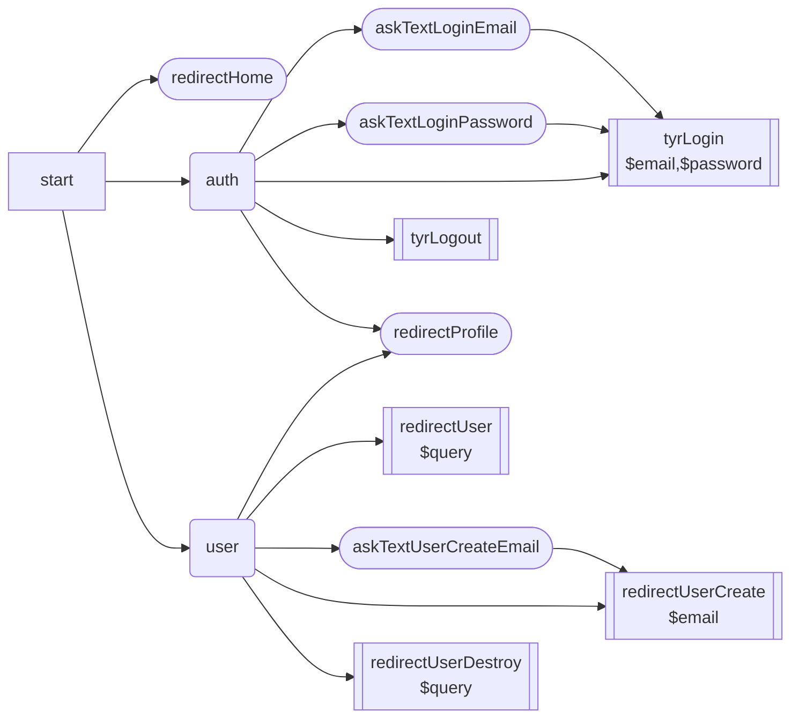

```mermaid
flowchart LR
    start --> Home([redirectHome])
    start --> auth(auth)
        auth --> TextLoginEmail([askTextLoginEmail])
        auth --> TextLoginPassword([askTextLoginPassword])
        auth --> Login[[tyrLogin
        $email,$password]]
        TextLoginEmail --> Login
        TextLoginPassword --> Login
        auth --> Logout[[tyrLogout]]
        auth --> Profile([redirectProfile])
    start --> user(user)
        user --> Profile([redirectProfile])
        user --> User[[redirectUser
        $query]]
        user --> TextUserCreateEmail([askTextUserCreateEmail])
        user --> UserCreate[[redirectUserCreate
        $email]]
        TextUserCreateEmail --> UserCreate
        user --> UserDestroy[[redirectUserDestroy
        $query]]
```
